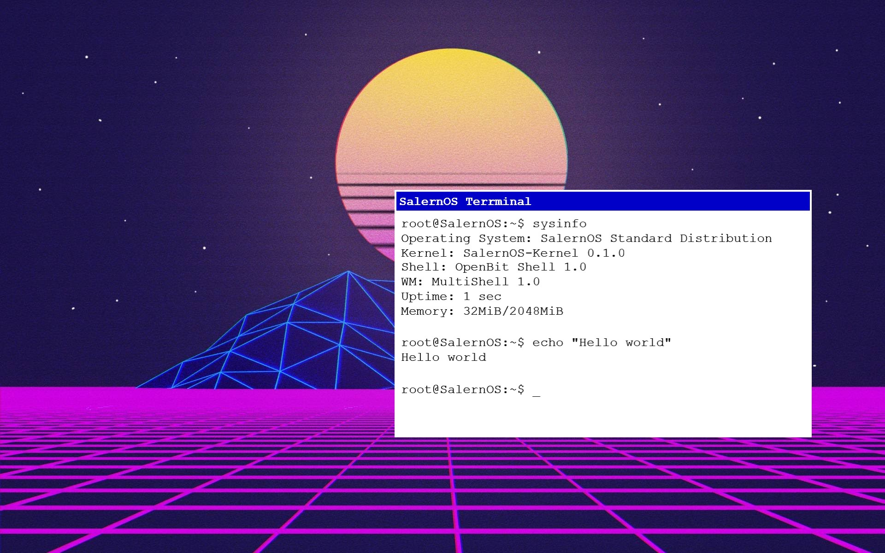

# SalernOS
SalernOS is a small, work-in-progress, one-man project to learn Operating System development by building one from scratch.

    
    
 This is a demo of what a future SalernOS Desktop may look like 

## Project Structure
Every component of SalernOS resides in its own repository, all respositories are hosted on this [GitHub account](https://github.com/Alessandro-Salerno).
The structure of individual SalernOS Components is not standardized.

## Goals
SalernOS is a toy Operating System. "toy" as in a piece of software that is written for non-commercial and non-professional use, but is rather intended for entertainment and improvement of programming skills. That said, I would like to achieve some milestones. These are, in no particular order:
* Establishing a framework for Hobbist Operating Systems - See [OpenBIT](https://github.com/OpenBitt)
* Building an alternative userland - Just for fun
* Bringing SalernOS to other processor platforms such as [AARCH64](https://en.wikipedia.org/wiki/AArch64) and [RISC-V](https://en.wikipedia.org/wiki/RISC-V)
* Bringing SalernOS to a self-designed processor architecture and running it in emulation or physical hardware (If possible)
* Porting the [GNU System](https://www.gnu.org/home.en.html) to SalernOS - Building GNU/SalernOS
* Building a Graphics Stack (GPU Drivers, [X11](https://en.wikipedia.org/wiki/X_Window_System)/[Wayland](https://en.wikipedia.org/wiki/Wayland_(display_server_protocol)) Server, Window Manager, OpenGL Implementation)
* Overall, making a farely simple, yet usable [FOSS](https://en.wikipedia.org/wiki/Free_and_open-source_software) graphical Operating System

## Right now
Currently, most of the work on SalernOS is concentrated on the [SalernOS-Kernel](https://github.com/Alessandro-Salerno/SalernOS-Kernel), and on building the [OpenBIT System Specification](https://github.com/OpenBitt/OpenBit-Specs/blob/main/OpenBIT-System-Specification.md). Despite all the effort, progress is slow, the SalernOS-Kernel is not yet ready for prime time, but I'm determined to get a somewhat usable version out by the end of 2022.

## The future
As shown in the picture, the short to medium term goal of SalernOS is to build a simple OS. Allthough the project is not fully outlined, the idea is to use a distribution model similar to that of [Linux](https://en.wikipedia.org/wiki/Linux) and other Free Operating SYstems. The SalernOS Standard Distribution would be the polished and working distro using GNU, while the SalernOS Experimental Distribution would be the 100% self-built software distribution. Standard Distribution components may include:
* [GCC - The GNU Compiler Collection](https://en.wikipedia.org/wiki/GNU_Compiler_Collection)
* [BASH](https://en.wikipedia.org/wiki/Bash_(Unix_shell))
* [Binutils - The GNU Linker](https://en.wikipedia.org/wiki/GNU_Binutils)
* [GNU Coreutils](https://en.wikipedia.org/wiki/GNU_Core_Utilities)
* X11/Wayland Server
* SalernOS MultiShell Window Manager
* Some random package manager

While the SalernOS Experimental Distribution may include:
* The SalernOS C Compiler
* The SalernOS Assembler
* The SalernOS Linker
* The OpenBit Shell
* X11/Wayland Server
* SalernOS MultiShell Window Manager
* SalernOS Core Utilities
* SGet - The SalernOS Package Manager
